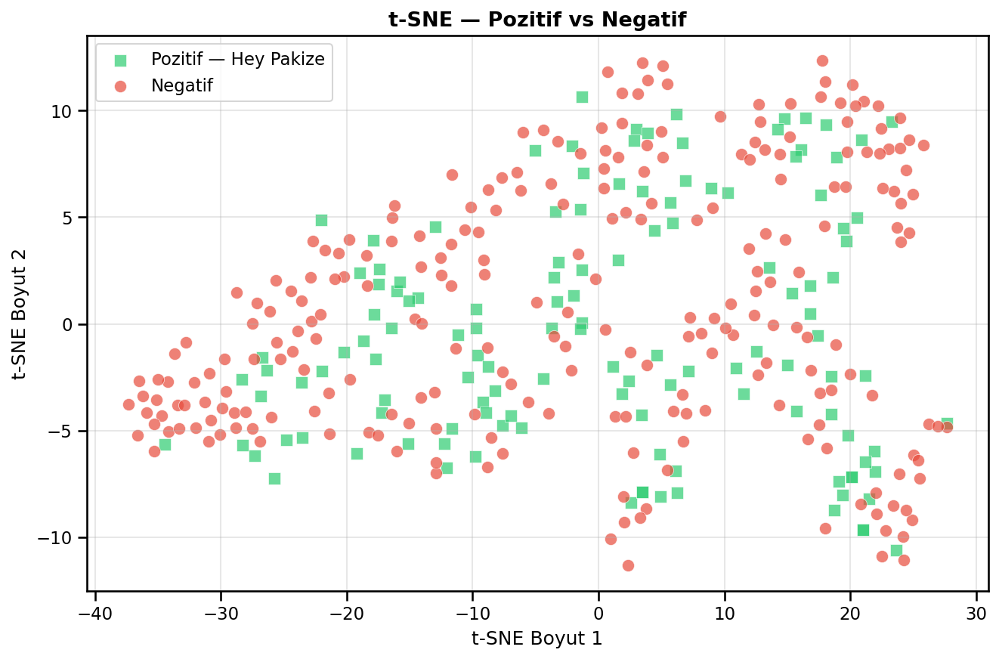
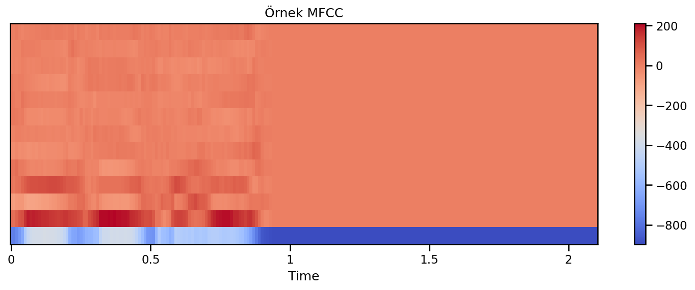
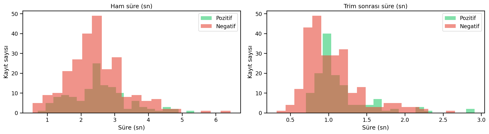

# Hey Pakize – Wake-Word Tespiti

MFCC ve SVM ile Türkçe "Hey Pakize" uyandırma ifadesinin tespiti

[🇹🇷 Türkçe](#türkçe) | [🇬🇧 English](#english)

---

## Türkçe

### Proje Hakkında

Çalışmanın amacı, ses kayıtlarından çıkarılan akustik özellikleri kullanarak Türkçe **"Hey Pakize"** uyandırma ifadesini makine öğrenmesi yöntemleriyle tespit etmektir.

Problem ikili sınıflandırma olarak ele alınmıştır: bir kayıt ya "Hey Pakize" ifadesini içerir (pozitif) ya da içermez (negatif).

Veri seti, okulda toplanan öğrenci ses kayıtlarından oluşmaktadır. Kayıtlar kişisel veri niteliği taşıdığı için bu repoda paylaşılmamıştır.

### Veri Seti

Toplam 378 kayıt kullanılmıştır:

- 131 pozitif kayıt ("Hey Pakize")
- 247 negatif kayıt (diğer konuşmalar)

Veri, sınıf oranı korunarak (stratify) %80 eğitim ve %20 test olarak ayrılmıştır.

- Eğitim seti: 302 kayıt
- Test seti: 76 kayıt

Kayıtlar 16 kHz örnekleme hızına getirilmiş, sessiz kısımlar kırpılmış ve sabit uzunluğa (33.600 örnek ≈ 2,1 sn) dönüştürülmüştür.

### Uygulanan Yaklaşımlar

#### 1. Özellik Çıkarma (MFCC)

Her kayıttan 13 MFCC çıkarılmış (`n_fft=512`, `hop_length=160`, `win_length=400`) ve istatistiksel özetlerle toplam 86 özellik oluşturulmuştur.

#### 2. Augmentation

Eğitim setine hafif veri artırma uygulanmıştır (pozitif kayıt başına 3, negatif kayıt başına 1 varyasyon). Eğitim seti 302 orijinal kayıttan 512 ek örnekle genişletilmiştir. Test setine augmentation uygulanmamıştır.

#### 3. Model 1: SVM (dar parametre aralığı)

`StandardScaler` + `SVC` (RBF çekirdek, `class_weight={0:1, 1:2}`). Hiperparametreler 5 katlı `GridSearchCV` ile F1 skoruna göre seçilmiştir.

#### 4. Model 2: SVM (geniş parametre aralığı)

Aynı yapı, daha geniş `C` ve `gamma` aralığıyla denenmiştir.

#### 5. Eşik Analizi

Karar eşiği 0.30–0.50 aralığında taranmış, F1 skoruna göre seçilmiştir.

### Model Sonuçları

Test seti (76 kayıt) üzerinde:

| Yaklaşım | Eşik | Accuracy | Precision | Recall | F1 |
|---|---|---|---|---|---|
| Model 1 (dar parametre aralığı) | 0.45 | %78,95 | 0,71 | 0,65 | **0,68** |
| Model 2 (geniş parametre aralığı) | 0.25 | %67,11 | 0,51 | 0,69 | 0,59 |

Model 1 daha dengeli sonuç vermiştir.

t-SNE görselleştirmesinde pozitif ve negatif örneklerin büyük ölçüde iç içe geçtiği görülmektedir. Bu, MFCC tabanlı özelliklerin iki sınıfı net biçimde ayıramadığını göstermektedir.



| Örnek MFCC | Süre Dağılımı |
|---|---|
|  |  |

### Sınırlamalar

- **Küçük veri:** 378 kayıt ve 76 kayıtlık test seti. Birkaç kayıt metrikleri belirgin biçimde değiştirir.
- **Eşik seçimi:** Karar eşiği doğrudan test seti üzerinde seçilmiştir. Bu nedenle rapor edilen F1 değeri iyimser olabilir. Doğrusu eşiğin ayrı bir doğrulama (validation) setinde seçilmesidir.
- **Çapraz doğrulama sızıntısı:** Augmentation, `GridSearchCV`'den önce uygulanmıştır. Aynı kaydın artırılmış kopyaları farklı katlara düştüğü için CV skoru (≈0,86) şişiktir. Genelleme performansı için test sonucu esas alınmalıdır.
- **Konuşmacı bağımsızlığı:** Bölme kayıt bazında yapılmıştır. Aynı konuşmacının kayıtları hem eğitim hem test setinde bulunabilir.

### Sonraki Adımlar

- Konuşmacıya göre bölme ve `GroupKFold` ile sızıntısız değerlendirme
- Eşiğin doğrulama setinde seçilmesi
- Daha fazla ve daha çeşitli veri
- Mel-spektrogram girdili derin öğrenme modeli ile karşılaştırma

### Notebook

Deneysel süreç tek bir Jupyter Notebook dosyasında yer almaktadır:

```
Hey_Pakize_Wake_Word_SVM.ipynb
```

Notebook; veri analizi, ön işleme, augmentation, özellik çıkarma, t-SNE görselleştirmesi, model eğitimi ve eşik analizi aşamalarını içermektedir.

### Proje Yapısı

```
hey-pakize-wake-word-svm/
│
├── Hey_Pakize_Wake_Word_SVM.ipynb
├── requirements.txt
├── README.md
│
├── tsne_clean.png
├── ornek_mfcc.png
└── sure_dagilimi.png
```

### Kurulum

Projeyi bilgisayarınıza klonladıktan sonra proje dizinine geçin:

```bash
git clone https://github.com/siladrtl/hey-pakize-wake-word-svm.git
cd hey-pakize-wake-word-svm
```

Sanal ortam oluşturulması önerilir:

```bash
python -m venv venv
```

Windows:

```bash
venv\Scripts\activate
```

Gerekli Python paketlerini yükleyin:

```bash
pip install -r requirements.txt
```

Notebook Google Colab'da çalıştırılmıştır. Veri yolları kendi Google Drive klasörüne göre ayarlıdır. Kendi verinizle çalıştırmak için `Hey_Pakize_Positives` ve `Not_Hey_Pakize` klasörlerini oluşturup yolları notebook'un başındaki ayar hücresinde güncelleyin.

### Veri Hakkında

Ses kayıtları okuldaki öğrencilere aittir ve kişisel veri niteliği taşıdığı için bu repoda **paylaşılmamıştır**. Notebook çıktılarından kişi adları ve dosya adları kaldırılmıştır.

### Uyarı

Bu proje yalnızca akademik ve eğitim amacıyla geliştirilmiştir.

---

## English

### About the Project

The goal of this project is to detect the Turkish wake phrase **"Hey Pakize"** using acoustic features extracted from voice recordings and classical machine learning methods.

The task is formulated as binary classification: a recording either contains the phrase "Hey Pakize" (positive) or it does not (negative).

The dataset consists of voice recordings collected from students at a school. Because the recordings are personal data, they are not shared in this repository.

### Dataset

A total of 378 recordings were used:

- 131 positive recordings ("Hey Pakize")
- 247 negative recordings (other speech)

The data was split 80% training / 20% test with stratification.

- Training set: 302 recordings
- Test set: 76 recordings

Recordings were resampled to 16 kHz, trimmed of silence and padded or cut to a fixed length (33,600 samples ≈ 2.1 s).

### Methodology

#### 1. Feature Extraction (MFCC)

13 MFCCs were extracted from each recording (`n_fft=512`, `hop_length=160`, `win_length=400`) and summarized with statistical features, yielding 86 features in total.

#### 2. Augmentation

Light data augmentation was applied to the training set only (3 variations per positive recording, 1 per negative recording), adding 512 augmented samples to the 302 original training recordings. No augmentation was applied to the test set.

#### 3. Model 1: SVM (narrow parameter grid)

`StandardScaler` + `SVC` (RBF kernel, `class_weight={0:1, 1:2}`). Hyperparameters were selected with 5-fold `GridSearchCV` using the F1 score.

#### 4. Model 2: SVM (wide parameter grid)

The same pipeline with a wider range of `C` and `gamma` values.

#### 5. Threshold Analysis

The decision threshold was scanned between 0.30 and 0.50 and selected based on the F1 score.

### Results

On the test set (76 recordings):

| Approach | Threshold | Accuracy | Precision | Recall | F1 |
|---|---|---|---|---|---|
| Model 1 (narrow grid) | 0.45 | 78.95% | 0.71 | 0.65 | **0.68** |
| Model 2 (wide grid) | 0.25 | 67.11% | 0.51 | 0.69 | 0.59 |

Model 1 gave the more balanced result.

The t-SNE visualization shows that positive and negative samples largely overlap, indicating that MFCC-based features do not clearly separate the two classes.

### Limitations

- **Small dataset:** 378 recordings and a 76-recording test set. A few recordings noticeably change the metrics.
- **Threshold selection:** The decision threshold was chosen directly on the test set, so the reported F1 may be optimistic. The correct approach is to select it on a separate validation set.
- **Cross-validation leakage:** Augmentation was applied before `GridSearchCV`. Augmented copies of the same recording can fall into different folds, so the CV score (≈0.86) is inflated. The test result should be used as the estimate of generalization performance.
- **Speaker independence:** The split was made at the recording level. Recordings from the same speaker may appear in both training and test sets.

### Future Work

- Speaker-wise splitting and `GroupKFold` for leakage-free evaluation
- Selecting the threshold on a validation set
- More and more diverse data
- Comparison with a deep learning model using mel-spectrogram input

### Notebook

The experimental workflow is contained in a single Jupyter Notebook:

```
Hey_Pakize_Wake_Word_SVM.ipynb
```

It covers data analysis, preprocessing, augmentation, feature extraction, t-SNE visualization, model training and threshold analysis.

### Project Structure

```
hey-pakize-wake-word-svm/
│
├── Hey_Pakize_Wake_Word_SVM.ipynb
├── requirements.txt
├── README.md
│
├── tsne_clean.png
├── ornek_mfcc.png
└── sure_dagilimi.png
```

### Installation

Clone the repository and navigate to the project directory:

```bash
git clone https://github.com/siladrtl/hey-pakize-wake-word-svm.git
cd hey-pakize-wake-word-svm
```

Creating a virtual environment is recommended:

```bash
python -m venv venv
```

On Windows:

```bash
venv\Scripts\activate
```

Install the required dependencies:

```bash
pip install -r requirements.txt
```

The notebook was run on Google Colab and its data paths point to a personal Google Drive. To run it with your own data, create the `Hey_Pakize_Positives` and `Not_Hey_Pakize` folders and update the paths in the setup cell at the top of the notebook.

### About the Data

The voice recordings belong to students at the school and are **not shared** in this repository because they are personal data. Personal names and file names have been removed from the notebook outputs.

### Disclaimer

This project was developed solely for academic and educational purposes.
